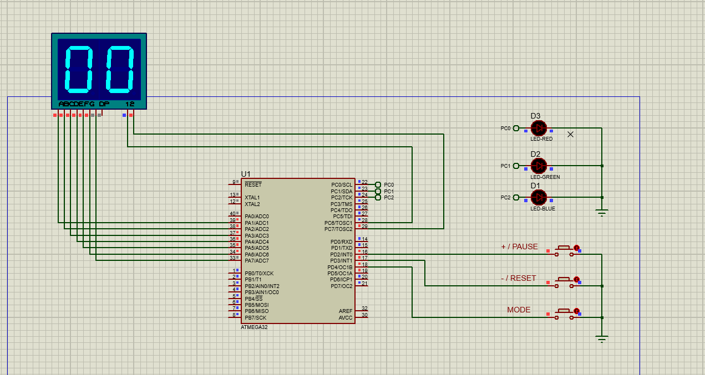

# StopWatch Project using AVR Atmega32 MCU

 ## Project Description

 This project is about simple countdown stopwatch implemented in avr atmega32 microcontroller using DIO peripheral. The stop watch is being adjusted that at every second elapsed the stopwatch will countdown.

 ### Hardware Componenets and tools used 
 - Microcontroller: AVR Atmega32. 
 - Hardware components used: Two digit seven segment MUX, 3 Push Buttons, 3 LEDS.
 - IDE: Avr Microship studio.

 ### Modes of system description
The system have two modes

- Calibration Mode
    - To enter calibration mode button **MODE** should be pressed. 
    - The **blue LED** will be flashed as indication in calibration mode.
    - The **+** and **-** actions will be activated. 
    - User can set the countdown using increment (**+**) and decrement (**-**) buttons.
    - Once calibration is done the **MODE** button should be pressed to exit the calibration mode to get into the runtime mode.

- Runtime Mode
    - The 7 segment will start to countdown after calibration mode being set.
    - The **PAUSE** and **RESET** actions will be activated. 
    - User can pause or reset the stopwatch.